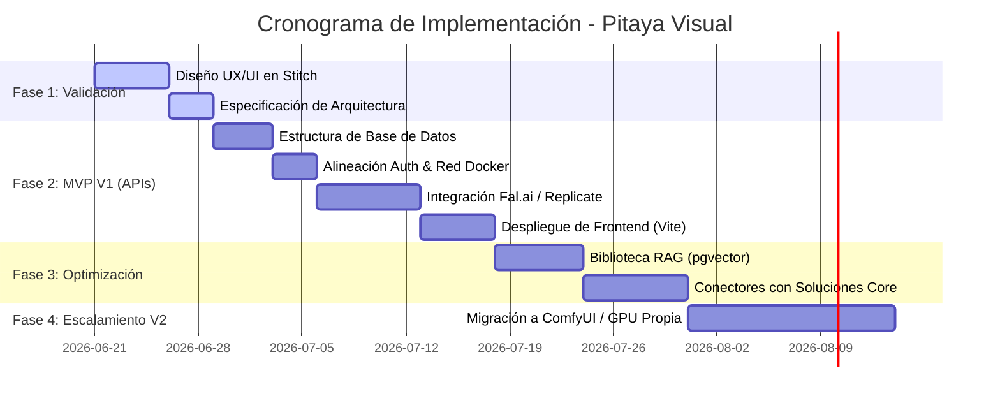

# Roadmap Estratégico de Implementación

Este roadmap define el camino de desarrollo para **Pitaya Visual** como la Creative Suite agéntica unificada de PitayaCore, estructurado en cuatro fases progresivas enfocadas en validación rápida de negocio y escalamiento técnico futuro.

---

---

## Detalle de Fases

### Fase 1: Validación y Especificación (Fase Actual)
*   **Objetivos**:
    *   Definición de lineamientos de experiencia del usuario: Ocultar ComfyUI, nodos y prompts técnicos, sustituyéndolos por la interacción conversacional ("Director Creativo").
    *   Creación del proyecto interactivo y sitemap en Stitch (`Pitaya Visual`).
    *   Registro del Design System oficial **Velvet Obsidian** (Outfit, Inter, Space Grotesk, HSL).
    *   Validación de los User Flows clave.

### Fase 2: MVP y Conectividad Externa (V1 - Integración de APIs)
*   **Infraestructura**:
    *   Alineación de la configuración de red docker (`pitaya_net`) y compartición de las instancias de bases de datos de PitayaCore (esquemas `pitayavisual_db` en MySQL y `pitayavisual_vector` en PostgreSQL).
    *   Configuración del `JWT_SECRET` en NestJS para validar tokens de usuarios de forma unificada.
*   **Backend & APIs**:
    *   Abstracción de generación visual: Implementación del servicio base de integración con proveedores externos:
        *   **Fal.ai** / **Replicate**: Ejecución asíncrona de modelos FLUX.1 (Schnell/Dev) y entrenamiento de LoRAs.
        *   **Gemini 1.5 Pro / Flash**: Motor conversacional (Agent Coordinator) y generación de brief de creativos.
    *   Integración con Cloudflare R2 para almacenamiento persistente y eficiente de activos generados.
*   **Frontend**:
    *   Creación del andamiaje en React Vite + TypeScript.
    *   Implementación de los componentes ShadCN personalizados con el estilo Velvet Obsidian.

### Fase 3: Integración de Soluciones Core y Optimización Semántica (V1.5)
*   **Búsqueda Semántica**:
    *   Configuración del RAG para la biblioteca de activos: Generación de embeddings (Gemini Text-Embedding) e indexado en pgvector en `pitayavisual_vector`. Búsqueda en lenguaje natural en la biblioteca.
*   **Integración con Ecosistemas Pitaya**:
    *   *AcuaCore*: Integración automática del agente "Aquaculture Educator" para generar flyers de capacitación técnica basados en los logs de producción piscícola.
    *   *Mando*: Interfaz para que el "Political Creative Director" genere campañas de propaganda electoral (stories, banners de Facebook) en base a lineamientos de partido.
    *   *LuxuryOS*: Interfaz para generar mockups de catálogo de joyería de lujo a partir de bocetos 2D.
*   **Automatización**:
    *   Liberación del Workflow Center simplificado para programar publicaciones en redes sociales directamente desde los activos generados.

### Fase 4: Escalamiento e Infraestructura Propia (V2)
*   **Objetivo**: Eliminar la dependencia de APIs externas para reducir costos operativos a escala y permitir control total del pipeline de generación visual.
*   **Acciones**:
    *   Despliegue de nodos locales de **ComfyUI** en servidores GPU dedicados (Hetzner) o **RunPod** (Serverless).
    *   Reemplazo de las llamadas API de Replicate/Fal por llamadas HTTP directas a la API de ComfyUI (utilizando sockets para progreso en tiempo real).
    *   Entrenamiento local de LoRAs de personajes para cada tenant, alojándolos de forma privada.
*   **Transparencia de UI**:
    *   Dado que el backend abstrae completamente el proveedor de renderizado mediante interfaces desacopladas, esta migración de infraestructura se realiza sin alterar una sola línea de código en el frontend React, manteniendo la experiencia intacta para el usuario de negocio.
