# Sitemap y Arquitectura de Navegación Multi-Tenant

Este documento define la estructura de navegación y el modelo de accesos para **Pitaya Visual**, la suite creativa agéntica integrada en PitayaCore.

---

## 1. Arquitectura de Navegación y Estructura de URLs

Pitaya Visual opera en un contexto multi-tenant. Cada cuenta corporativa (Tenant) accede a un entorno aislado mediante un prefijo en la URL.

**Formato base de URL:** `https://app.pitayacore.com/t/:tenantId/visual/`

### Mapa del Sitio (Sitemap)

```mermaid
graph TD
    %% Base routes
    Dashboard["/visual/dashboard (Dashboard Principal)"]
    Chat["/visual/chat (Creative Chat)"]
    Characters["/visual/characters (Character Studio)"]
    Campaigns["/visual/campaigns (Campaign Builder)"]
    Library["/visual/library (Asset Library)"]
    Brand["/visual/brand (Brand Studio)"]
    Workflows["/visual/workflows (Workflow Center)"]
    Settings["/visual/settings (Configuración de Tenant)"]

    %% Dashboard Actions
    Dashboard --> Chat
    Dashboard --> Campaigns
    Dashboard --> Characters
    Dashboard --> Library

    %% Characters Sub-views
    Characters --> CharDetail["/visual/characters/:id (Detalle y LoRAs)"]
    Characters --> CharNew["/visual/characters/new (Crear Personaje)"]

    %% Campaigns Sub-views
    Campaigns --> CampDetail["/visual/campaigns/:id (Tablero de Campaña)"]
    Campaigns --> CampNew["/visual/campaigns/new (Nueva Campaña)"]

    %% Workflows Sub-views
    Workflows --> WorkflowTemplates["/visual/workflows/templates (Plantillas)"]
    Workflows --> WorkflowHistory["/visual/workflows/history (Historial de Ejecución)"]

    %% Settings Sub-views
    Settings --> SetBilling["/settings/billing (Créditos y Consumo)"]
    Settings --> SetAPIs["/settings/integrations (API Keys de Proveedores)"]
```

---

## 2. Jerarquía Detallada de Páginas

### 1. Dashboard Principal (`/visual/dashboard`)
*   **Propósito**: Centro de control del Tenant. Permite a los directores creativos y especialistas ver el pulso de la generación de contenido.
*   **Paneles**:
    *   *Últimas Generaciones*: Carrusel o grid rápido de imágenes y videos recientes.
    *   *Campañas Activas*: Estado de las campañas cruzadas (ej. Mando, LuxuryOS).
    *   *Personajes Activos*: Avatares rápidos y atajos a entrenamiento.
    *   *Consumo e Infraestructura*: Créditos restantes, APIs conectadas y cuotas mensuales.
*   **Acciones Rápidas**:
    *   Botón para iniciar un chat creativo.
    *   Botón para crear un personaje.
    *   Botón para iniciar una campaña.

### 2. Creative Chat (`/visual/chat`)
*   **Propósito**: Espacio principal de interacción agéntica (estilo ChatGPT + Claude Artifacts).
*   **Paneles**:
    *   *Sidebar Izquierdo*: Historial de conversaciones organizadas por fecha y etiquetas de proyectos/campañas.
    *   *Panel Central (Chat)*: Hilo interactivo donde se conversa con el "Director Creativo IA".
    *   *Panel Derecho (Inspector/Preview)*: Visor de activos generados (imágenes, copys, videos, storyboards) con opciones de refinamiento o descarga sin salir del chat.

### 3. Character Studio (`/visual/characters`)
*   **Propósito**: Gestión de la identidad e influencers/modelos virtuales del Tenant.
*   **Vistas secundarias**:
    *   *Listado de Personajes* (`/visual/characters`): Grid con tarjetas de personajes (ej. Alba para AcuaCore, Luxury Ambassador para LuxuryOS).
    *   *Detalle del Personaje* (`/visual/characters/:id`): Configuración de estilo visual, biografía, tono, fotos de referencia y estado de entrenamiento de LoRAs (oculto tras bambalinas).
    *   *Creador de Personajes* (`/visual/characters/new`): Formulario guiado por IA para inicializar un nuevo avatar y generar sus primeras imágenes de muestra.

### 4. Campaign Builder (`/visual/campaigns`)
*   **Propósito**: Planificación visual y generación de conjuntos de creativos estructurados.
*   **Vistas secundarias**:
    *   *Listado de Campañas* (`/visual/campaigns`): Grid que agrupa campañas por industria y canal (Facebook, Instagram, Web, Print).
    *   *Tablero de Campaña* (`/visual/campaigns/:id`): Vista estilo kanban o mesa de luz donde se organizan los diferentes formatos de creativos (Banners, Stories, Flyers) asociados a la campaña.
    *   *Creador de Campaña* (`/visual/campaigns/new`): Asistente de configuración de objetivo, audiencia, personaje asociado, canales, y formatos requeridos.

### 5. Asset Library (`/visual/library`)
*   **Propósito**: DAM (Digital Asset Manager) simplificado para el Tenant.
*   **Características**:
    *   *Filtros Avanzados*: Tipo (Imagen, Video, Storyboard, Copy), Persona asociada, Campaña, Fecha, Creador.
    *   *Búsqueda Semántica*: Búsqueda en lenguaje natural (ej. "Fotos de camarones en agua cristalina de noche") impulsada por embeddings en pgvector.
    *   *Organización*: Creación de carpetas virtuales y tableros de inspiración compartidos.

### 6. Brand Studio (`/visual/brand`)
*   **Propósito**: Configuración de la guía de estilo de marca del Tenant.
*   **Paneles**:
    *   *Identidad Visual*: Carga de logotipos, variantes (light/dark) y definición de paleta de colores corporativos.
    *   *Tipografía*: Fuentes para títulos y cuerpo (integración con Google Fonts).
    *   *Guía Estilística*: Instrucciones para la IA sobre qué evitar o qué priorizar visualmente (ej. "Estilo fotográfico realista, evitar ilustraciones, iluminación cálida").
    *   *Tono de Comunicación*: Voz de la marca (ej. "Técnico pero educativo" para AcuaCore).

### 7. Workflow Center (`/visual/workflows`)
*   **Propósito**: Gestión de automatizaciones y pipelines de generación.
*   **Características**:
    *   *Plantillas predefinidas*: Flujos comunes como "Generar banner semanal y programar a Buffer/Meta".
    *   *Historial de ejecuciones*: Log visual de ejecuciones del motor agéntico (ej. "Paso 1: Generación de copy -> Paso 2: Generación de imagen -> Paso 3: Render de video").
    *   *Conectores*: Configuración simplificada de entrada y salida (Webhook, Web, Email).

---

## 3. Modelo de Permisos y Roles (Multi-Tenant)

Para garantizar la seguridad y privacidad entre tenants, se define la siguiente matriz de roles y permisos para Pitaya Visual:

| Permiso / Acción | Tenant Admin | Creative Director | Marketing Specialist | External Reviewer (Cliente) |
| :--- | :---: | :---: | :---: | :---: |
| **Configurar APIs e Integraciones** | Sí | No | No | No |
| **Modificar Brand Studio** | Sí | Sí | No | No |
| **Crear / Entrenar Personajes** | Sí | Sí | No | No |
| **Gestionar Workflows** | Sí | Sí | No | No |
| **Iniciar Creative Chat / Generar** | Sí | Sí | Sí | No |
| **Crear y Modificar Campañas** | Sí | Sí | Sí | No |
| **Ver Asset Library / Descargar** | Sí | Sí | Sí | Sí |
| **Aprobar Creativos para Campañas**| Sí | Sí | No | Sí (Solo Aprobación/Comentarios)|

*   **Tenant Admin**: Control total sobre el tenant, facturación, consumo y conexiones API.
*   **Creative Director**: Responsable de definir la identidad estética de la marca, crear personajes, plantillas de workflows y aprobar campañas.
*   **Marketing Specialist**: Usuario ejecutor que utiliza el chat y creador de campañas para generar los activos bajo las guías estipuladas.
*   **External Reviewer**: Rol de lectura para que clientes finales de agencias de marketing (o directores de sucursales) revisen y aprueben/comenten activos antes de su publicación.
