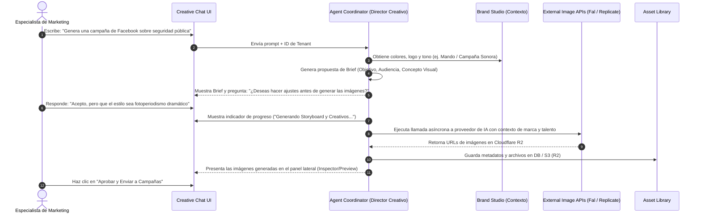
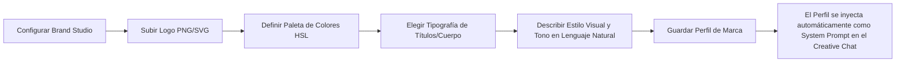

# Flujos de Usuario (User Flows) Principales

Este documento detalla la lógica de interacción de los tres flujos de usuario más críticos dentro de **Pitaya Visual**.

---

## Flujo 1: Creación de Campaña Conversacional (Creative Chat)

Este flujo representa el corazón de la plataforma. La interacción se siente como hablar con un "Director Creativo", abstrayendo toda la complejidad técnica de la IA.



### Detalle del Paso 8 (Progreso y Retroalimentación)
Durante el proceso de generación, el chat muestra un componente de progreso que explica qué está haciendo la IA paso a paso, aumentando la confianza del usuario:
1.  `[x] Analizando guía de estilo de la campaña` (0.5s)
2.  `[x] Generando prompts optimizados para FLUX.1` (1.2s)
3.  `[/] Renderizando imágenes de campaña con Fal.ai` (4.5s)
4.  `[ ] Guardando en la Biblioteca de Activos` (esperando)

---

## Flujo 2: Entrenamiento y Gestión de Personaje (Character Studio)

Permite a un Director Creativo entrenar y definir un personaje virtual (ej. Alba, Don Juan Camarón) de forma guiada por lenguaje natural.

```mermaid
graph TD
    A[Director Creativo] -->|Click en Crear Personaje| B(Character Studio UI)
    B -->|Ingresa Nombre y Descripción| C{¿Tiene imágenes de referencia?}
    C -->|Sí| D[Sube 5-15 fotos de referencia]
    C -->|No| E[IA genera retratos base mediante chat interactivo]
    D --> F[IA procesa y etiqueta fotos automáticamente]
    E --> F
    F --> G[IA inicia asimilación de perfil visual (fine-tuning)]
    G -->|En segundo plano| H[Notificación de perfil completado]
    H --> I[Talento listo para usarse en Creative Chat]
```

### Detalle del Flujo de Creación de Perfil (Sin Nodos)
1.  **Entrada**: El usuario provee una descripción base: *"Don Juan Camarón: Un pescador mexicano de 50 años, tez curtida por el sol, barba blanca recortada, viste camisa de lino clara y sombrero de paja."*
2.  **Etiquetado Automático**: El agente analiza las fotos subidas y genera descripciones automáticas para asimilar el perfil del talento.
3.  **Abstracción de Infraestructura**: El backend orquesta la asimilación del estilo de forma transparente. Para el usuario final, solo aparece un mensaje de "Preparando Identidad Visual...".

---

## Flujo 3: Ajuste de Marca y Estilo (Brand Studio)

Asegura que todas las generaciones del tenant respeten estrictamente la identidad visual corporativa sin importar qué especialista de marketing use el chat.



### Ejemplo de System Prompt Inyectado:
```text
Eres el Director Creativo de Mando para la campaña 'Sonora Segura'.
Debes respetar los siguientes lineamientos:
- Colores principales: Vino (#800020) y Dorado (#D4AF37).
- Tipografía de marca: Outfit.
- Estilo visual obligatorio: Fotografía de alta calidad, iluminación natural, tomas de ángulo medio. Evitar ilustraciones, estilo 3D o caricaturesco.
- Tono: Seguro, empático, profesional.
```
